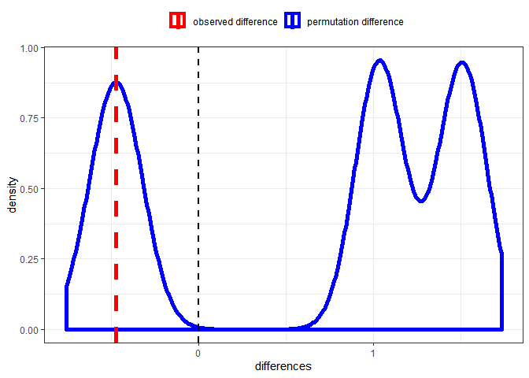
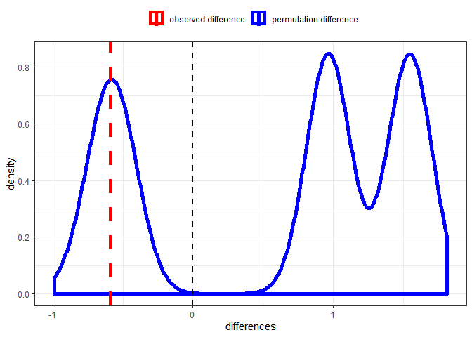

Teste de Permutação
================

Nesse arquivo implemento um teste de permutação tendo como resultado as

Essa função possui os seguintes argumentos:

  - **data**: *data frame* com os grupos e dados
  - **group**: variável que indica os grupos para comparação
  - **statistic**: estatística com base na qual os grupos serão
    comparados
  - **values**: valores numéricos
  - **alternative**: *two.sided* (padrão), *less* ou *greater*
  - **b**: número de amostras boostrap utilizadas para o teste (padrão é
    b = 2500)

## *Mean - two.sided*

**Exemplo 1**: \(A \sim N(1, 1)\) e \(B \sim N(1.1, 1)\)

``` r
set.seed(123)

data <- data.frame(type = c(rep("A", 300), rep("B", 300)),
                   values = c(rnorm(300, 1), rnorm(300, 1.5)))

perm_test(data, "type", "values", alternative = "two.sided", statistic = "mean", b = 2500)
```

<!-- -->

    ## # A tibble: 1 x 4
    ##       A     B    dif statistic
    ##   <dbl> <dbl>  <dbl>     <dbl>
    ## 1  1.03  1.51 -0.475     0.831

## *Median - two.sided*

**Exemplo 1**: \(A \sim N(1, 1)\) e \(B \sim N(1.1, 1)\)

``` r
set.seed(123)

data <- data.frame(type = c(rep("A", 300), rep("B", 300)),
                   values = c(rnorm(300, 1), rnorm(300, 1.5)))

perm_test(data, "type", "values", alternative = "two.sided", statistic = "median", b = 2500)
```

<!-- -->

    ## # A tibble: 1 x 4
    ##       A     B    dif statistic
    ##   <dbl> <dbl>  <dbl>     <dbl>
    ## 1 0.956  1.55 -0.589     0.823
"# permutation" 
